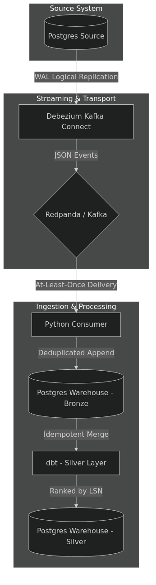

# Production-Grade CDC Pipeline: Handling Chaos

## The Problem
Most portfolio data engineering projects assume a "happy path". They assume that events arrive precisely once, and they arrive perfectly in order. 
In a real production environment, networks partition, consumers crash mid-batch, and backfills collide with live streams. 

This project demonstrates a production-grade Change Data Capture (CDC) pipeline that explicitly handles:
1. **Duplicate Delivery:** Handled via exact-once idempotent ingestion based on Kafka offsets.
2. **Out-of-Order Events:** Handled via deterministic merges relying on Postgres Log Sequence Numbers (LSN), rather than wall-clock time.
3. **Consumer Crashes:** Proven resilient via an automated Chaos Test.

## Architecture
The pipeline uses Postgres (Source) -> Debezium -> Redpanda (Kafka) -> Python Consumer -> Postgres (Warehouse) -> dbt.



See [`docs/architecture.md`](docs/architecture.md) for the full Mermaid diagram source and component breakdown.
See [`docs/correctness.md`](docs/correctness.md) for a detailed explanation of the myth of exactly-once delivery and how this pipeline achieves effectively-once processing.

## How to Run it Locally

### Prerequisites
- Docker & Docker Compose
- Python 3.11+ (for running the chaos test)
- `make`

### Quick Start
1. **Spin up the stack:**
   ```bash
   make up
   ```
   *This starts the Postgres databases, Redpanda, Debezium, the Synthetic Data Generator, and the Python Consumer. It will also automatically register the Debezium connector.*

2. **Run dbt manually to build the Silver layer:**
   ```bash
   make dbt-run
   ```

3. **Run the Chaos Test (The Proof):**
   ```bash
   make chaos
   ```
   *This script lets the pipeline run, violently kills the consumer, lets data back up, restarts the consumer, runs dbt, and then performs a row-by-row comparison between the source transactional DB and the analytical warehouse. It asserts that 0 rows are dropped, duplicated, or corrupted.*

4. **Tear down:**
   ```bash
   make down
   ```

## Limitations & Shortcuts (Interview Talking Points)
While this pipeline demonstrates core CDC logic, some shortcuts were taken to ensure it runs easily via `docker-compose`:
- **Single Node Infrastructure:** Redpanda and Postgres are running as single nodes. In production, these would be highly available clusters.
- **dbt Execution:** Here, dbt is triggered manually or via the chaos script for demonstration. In production, the raw `bronze` ingestion would stream continuously, and dbt would be orchestrated on a schedule (e.g., via Airflow or Dagster) or replaced by a streaming engine like Flink.
- **Schema Registry:** To reduce local footprint, this setup avoids a Confluent Schema Registry and relies on raw JSON. In a real environment, Avro or Protobuf with a Schema Registry is critical to handle schema evolution safely.
