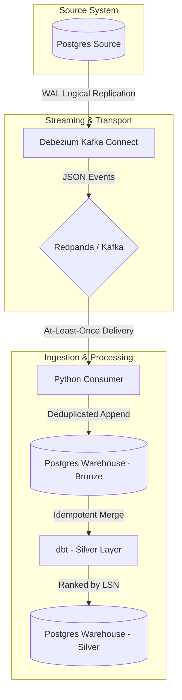

# Pipeline Architecture

This CDC pipeline is designed for robustness under failure. It extracts changes from a transactional Postgres database using logical replication and lands them in a downstream analytical Postgres instance (simulating a data warehouse).

## Data Flow

## Component Roles
- **Source Database**: Simulates the production transactional database. Uses Postgres `wal_level=logical`.
- **Debezium**: Connects to the Postgres replication slot, reads the Write-Ahead Log (WAL), and converts row-level changes into JSON events.
- **Redpanda**: A lightweight Kafka-compatible message broker holding the CDC events in topics.
- **Consumer**: A Python worker that polls Redpanda and lands events into the `bronze` raw layer. It deduplicates based on Kafka offsets to guarantee exactly-once ingestion.
- **dbt**: Transforms the raw events into the `silver` domain models, using a custom incremental strategy that respects the original transaction LSN (Log Sequence Number) to correctly resolve out-of-order updates.
